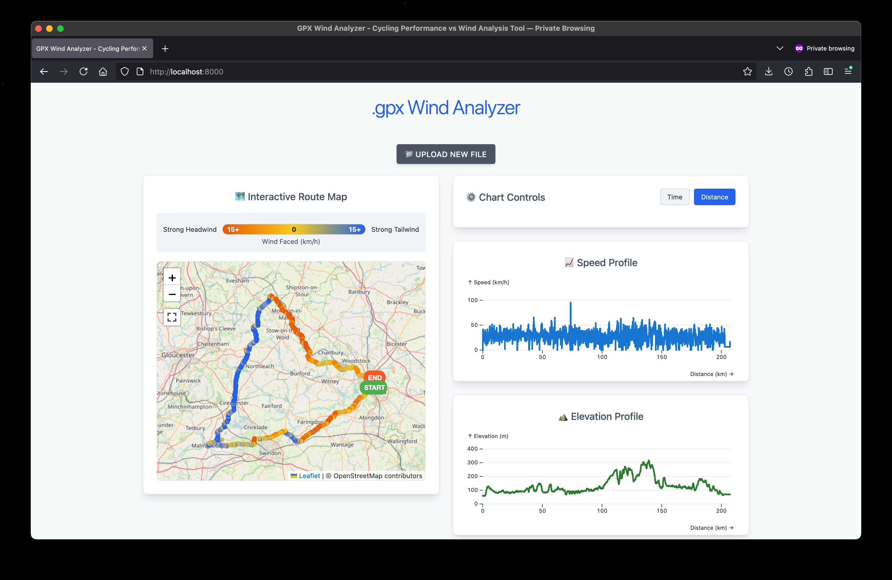

# GPX Wind Analyzer 🌪️

A web-based tool for viewing cycling performance against wind conditions using GPX track data and historical weather information.

## Overview

The GPX Wind Analyzer helps cyclists understand how wind conditions affected their ride performance by combining GPS track data with historical weather data. Upload a GPX file from your cycling computer or smartphone, and get detailed insights into headwinds, tailwinds, and their impact on your speed and effort.

## Features

### 📁 Easy File Upload
- Drag & drop or click to upload GPX files
- Supports standard GPX formats from popular cycling computers (Garmin, Wahoo, etc.)
- Automatic validation and error handling for malformed files

### 🗺️ Interactive Route Visualization
- **Color-coded route map** showing wind conditions along your entire ride
- **Continuous color gradient** from dark teal (strong tailwind) to red (strong headwind)
- **Interactive tooltips** with detailed wind diagrams showing:
  - Wind direction vs. your travel direction
  - Wind speed and your cycling speed
  - Headwind/tailwind classification
- **Start/End markers** clearly marking your route endpoints

### 📊 Comprehensive Charts
- **Speed Profile**: Track your speed variations over time or distance
- **Elevation Profile**: Visualize climbs and descents along your route
- **Wind Faced Profile**: See exactly where you encountered headwinds vs. tailwinds
- **Interactive hover**: Mouse over any chart to see the corresponding location on the map
- **Dual X-axis options**: View data by time or distance

### 📈 Performance Statistics
- Total distance and ride time
- Average speed and maximum speed
- Average wind speed encountered
- Maximum headwind and tailwind speeds
- Percentage of ride spent fighting headwinds
- Average wind impact on your ride

## How It Works

1. **Upload GPX File**: Your GPS track must include timestamps for accurate weather data retrieval
2. **Historical Weather Lookup**: The system fetches wind data from OpenMeteo's historical weather API for your route's date/time
3. **Wind Analysis**: Calculates relative wind impact by comparing wind direction with your travel direction
4. **Visualization**: Creates interactive maps and charts showing wind conditions throughout your ride

## Technical Details

### Wind Calculation
- Calculates **relative wind angle** between wind direction and cycling direction
- Computes **wind component** in your direction of travel (headwind positive, tailwind negative)
- Interpolates wind data along your route for smooth visualization

### Color Mapping
- **Continuous color interpolation** across a 30 km/h wind range (-15 to +15 km/h)
- Colors progress from blue (tailwind) through neutral to red (headwind)
- Real-time color updates based on actual wind conditions

### Performance Optimizations
- **Throttled map updates** for smooth hover interactions
- **Progressive data loading** with real-time progress indicators
- **Efficient route smoothing** for better visual representation
- **Responsive design** that works on desktop and mobile devices

## File Requirements

Your GPX file must contain:
- **Valid GPS coordinates** (latitude/longitude)
- **Timestamps** for each track point (essential for weather data lookup)
- Standard GPX format with `<trkpt>`, `<rtept>`, or `<wpt>` elements

Most modern GPS devices and cycling apps automatically include this information.

## Libraries & Dependencies

- **Leaflet** - Interactive maps
- **Observable Plot** - Data visualization and charts  
- **D3.js** - Data manipulation and SVG rendering
- **Tailwind CSS** - Responsive UI styling
- **OpenMeteo API** - Historical weather data

## Privacy & Data

- **No data storage**: GPX files are processed entirely in your browser
- **No account required**: Completely anonymous usage
- **API calls**: Only weather data requests are sent to external services
- **Local processing**: All GPS calculations happen on your device

## Usage Tips

- **Best results**: Use GPX files from dedicated cycling computers for most accurate data
- **Time zones**: Ensure your device's time zone was set correctly during recording
- **File size**: Larger files may take longer to process but provide more detailed analysis
- **Internet required**: Weather data lookup requires active internet connection

## Getting Started

1. Visit the website
2. Upload your GPX file using drag & drop or file picker
3. Wait for wind data analysis to complete
4. Explore the interactive map and charts
5. Review your performance statistics

Perfect for cyclists who want to understand how weather conditions affected their ride performance and plan future routes accordingly!

## Development

This is a client-side web application built with vanilla JavaScript and modern web APIs. To run locally:

1. Clone the repository
2. Serve the files using any web server (e.g., `python -m http.server`)
3. Open in your browser

No build process or server-side components required.
